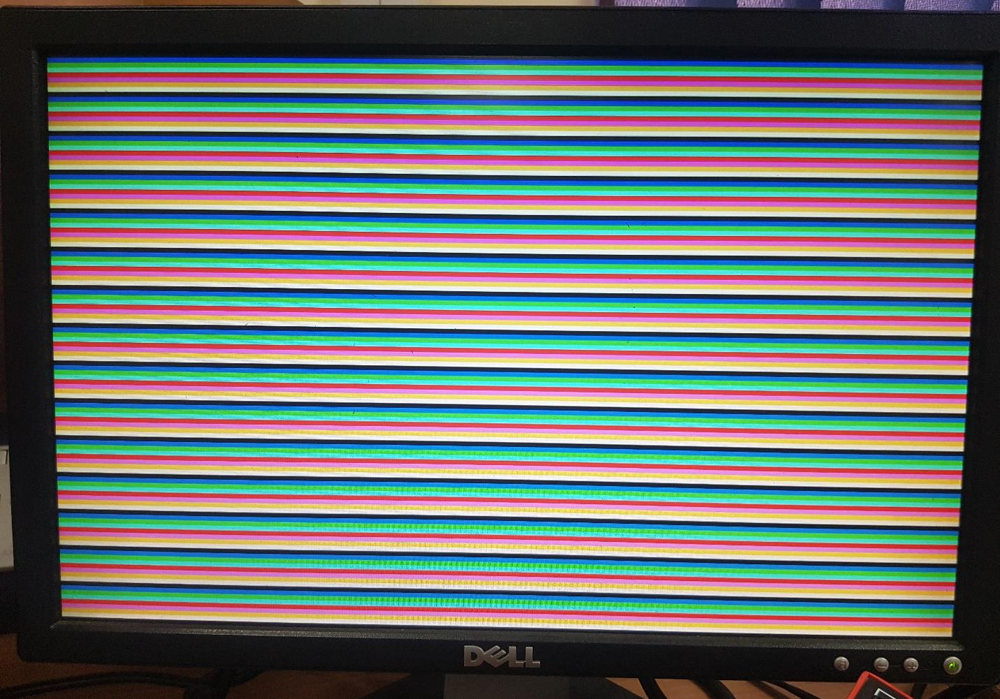
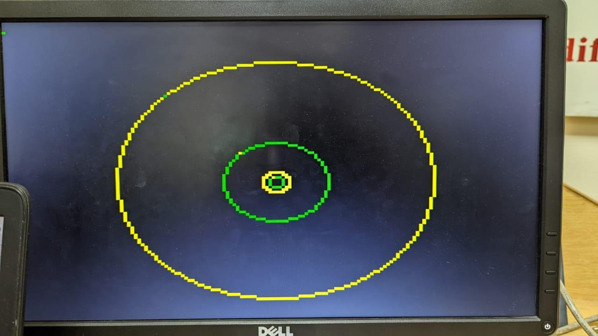

# FPGA VGA Graphics Engine: Color Fill & Bresenham Circle Drawing

Verilog HDL implementations of VGA graphics rendering on an **Intel Cyclone V FPGA (DE1-SoC Board)**. This project features two core modules: an FSM-based screen color fill engine and a hardware implementation of the **Bresenham Circle Drawing Algorithm** — both driving a 160x120 VGA display in real-time.

> Developed as part of the Digital System Design course at **NUST (National University of Sciences & Technology)**.

---

## Project Overview

### Task 1: VGA Color Fill Engine

A finite state machine (FSM) that fills a 160x120 VGA display with **8 repeating color bands**. The design initializes the screen to black, then sequentially writes pixels row-by-row, cycling through all 8 available colors (3-bit RGB).

**Key Design Concepts:**
- 2-state FSM (Idle / Active) with switch-controlled transitions
- Pixel-by-pixel raster scan (X increments per clock, Y increments at row end)
- Color assignment using `Y % 8` for repeating horizontal bands
- Black screen initialization before color fill
- VGA adapter interface at 160x120 resolution, 1-bit per color channel

```
 ┌──────────┐     ┌─────────────┐     ┌─────────────┐     ┌───────────┐
 │  50 MHz  │────>│  FSM State  │────>│ Pixel Color │────>│    VGA    │───> Monitor
 │  Clock   │     │  Controller │     │  Generator  │     │  Adapter  │
 └──────────┘     └─────────────┘     └─────────────┘     └───────────┘
                        ^                                       ^
                        │                                       │
                   [ SW[0] ]                              [ 160x120 ]
                   Reset/Start                            Resolution
```

### Task 2: Bresenham Circle Drawing Algorithm

A hardware implementation of the **Bresenham (Midpoint) Circle Algorithm** that renders circles on the VGA display with **adjustable radius** and **selectable color** — all controlled via the DE1-SoC switches and keys.

**Key Design Concepts:**
- 13-state FSM (RESET, BLANK, STOP, HOLD, INITIAL, STATE1-STATE8)
- Integer-only arithmetic — no floating point or multiplications beyond shifts
- 8-way symmetry exploitation: each iteration plots 8 pixels simultaneously
- Decision parameter `d = 3 - 2*R` determines pixel placement
- Radius input via `SW[8:3]` (clamped to max 59), color via `SW[2:0]`
- Button-triggered circle drawing with screen clear between draws

```
 ┌────────────┐     ┌──────────────┐     ┌────────────────┐     ┌───────────┐
 │  Switches  │────>│  13-State    │────>│   Bresenham    │────>│    VGA    │───> Monitor
 │  & Keys    │     │  FSM Control │     │   8-Way Plot   │     │  Adapter  │
 └────────────┘     └──────────────┘     └────────────────┘     └───────────┘
   RAD, COLOR            │                  (xc±xr, yc±yr)
                         │                  (xc±yr, yc±xr)
                    Screen Blank
                    Before Draw
```

**Bresenham Algorithm (Hardware):**
```
Initialize: xr = 0, yr = R, d = 3 - 2R

For each iteration while xr <= yr:
  Plot 8 symmetric points:
    (xc+xr, yc+yr)  (xc-xr, yc+yr)
    (xc+xr, yc-yr)  (xc-xr, yc-yr)
    (xc+yr, yc+xr)  (xc-yr, yc+xr)
    (xc+yr, yc-xr)  (xc-yr, yc-xr)

  if d < 0:  d = d + 4*xr + 6
  else:      d = d + 4*(xr-yr) + 10,  yr--
  xr++
```

---

## Hardware Output

<table>
  <tr>
    <td align="center"><br><sub>8-Color Band Fill (Task 1)</sub></td>
    <td align="center"><br><sub>Bresenham Circles - Variable Radius (Task 2)</sub></td>
  </tr>
</table>

---

## Project Structure

```
FPGA-VGA-Graphics-Engine/
├── task2_color_fill/
│   ├── rtl/
│   │   └── Task2.v                    # FSM color fill module
│   └── quartus/
│       ├── Task2.qpf                  # Quartus project file
│       └── Task2.qsf                  # Pin assignments & settings
├── task3_bresenham_circle/
│   ├── rtl/
│   │   └── Task3.v                    # Bresenham circle module
│   └── quartus/
│       ├── Task3.qpf                  # Quartus project file
│       └── Task3.qsf                  # Pin assignments & settings
├── shared/
│   ├── vga_ip/
│   │   ├── vga_adapter.v              # VGA display adapter (160x120 / 320x240)
│   │   ├── vga_adapter.bsf            # Block symbol file
│   │   ├── vga_controller.v           # VGA timing & signal controller
│   │   ├── vga_address_translator.v   # (X,Y) to memory address mapper
│   │   └── vga_pll.v                  # 50MHz -> 25MHz PLL clock divider
│   └── DE1_SoC.qsf                   # DE1-SoC board pin assignments
├── docs/images/                       # Hardware output photos
│   ├── color_fill_output.jpeg
│   └── bresenham_circle_output.jpeg
└── README.md
```

---

## VGA Adapter IP

Both tasks share a common **VGA Adapter IP core** that handles:

| Module | Function |
|:--|:--|
| `vga_adapter.v` | Top-level VGA interface with configurable resolution, color depth, and background image |
| `vga_controller.v` | Generates VGA timing signals (HSYNC, VSYNC, BLANK) for 640x480@60Hz |
| `vga_address_translator.v` | Converts (X, Y) pixel coordinates to linear video memory addresses |
| `vga_pll.v` | Divides 50MHz board clock to 25MHz VGA pixel clock |

**Configuration used:**
- Resolution: `160x120` (4x4 superpixels on 640x480 display)
- Color depth: 1 bit per channel (8 colors total)
- Monochrome: `FALSE`

---

## Tools & Technologies

| Tool | Purpose |
|:--|:--|
| **Verilog HDL** | Hardware description language |
| **Intel Quartus Prime 20.1** (Lite Edition) | Synthesis, place & route, pin assignment |
| **Xilinx Vivado** | FPGA design, synthesis & implementation |
| **HLS (High-Level Synthesis)** | C/C++ to RTL hardware acceleration |
| **DE1-SoC Board** (Cyclone V 5CSEMA5F31C6) | FPGA hardware verification |
| **VGA Monitor** | Real-time display output via DAC |

---

## Getting Started

### Prerequisites
- Intel Quartus Prime (Lite Edition 20.1 or later)
- DE1-SoC board with VGA monitor connected

### Running Task 1 (Color Fill)
```
1. Open Quartus -> File -> Open Project -> task2_color_fill/quartus/Task2.qpf
2. Compile: Processing -> Start Compilation
3. Program FPGA: Tools -> Programmer -> Start
4. Toggle SW[0] on the board to start/reset the color fill
```

### Running Task 2 (Circle Drawing)
```
1. Open Quartus -> File -> Open Project -> task3_bresenham_circle/quartus/Task3.qpf
2. Compile: Processing -> Start Compilation
3. Program FPGA: Tools -> Programmer -> Start
4. Set radius via SW[8:3], color via SW[2:0]
5. Press KEY[3] to draw circle, KEY[0] to reset
```

---

## Author

**Ryan Amjad**

---

## License

This project is open source and available for educational purposes.
